GAnnoViz
================

- [GAnnoViz](#gannoviz)
  - [1. Introduction](#1-introduction)
  - [2. Install & Library](#2-install--library)
  - [3. Local Shinyapp](#3-local-shinyapp)
  - [4. Prepare Datasets](#4-prepare-datasets)
  - [5. Retrieve Ensembl](#5-retrieve-ensembl)
  - [6. Extract Features](#6-extract-features)
  - [7. Plot Structure](#7-plot-structure)
  - [8. DEG Anno & Viz](#8-deg-anno--viz)
  - [9. SNP Anno & Plot](#9-snp-anno--plot)
  - [10. DMG Anno & Plot](#10-dmg-anno--plot)
  - [11. Session Information](#11-session-information)

# GAnnoViz

## 1. Introduction

**GAnnoViz: a R package for genomic annotation and visualization.**

***GAnnoViz is a cloud-integrated framework for chromosome-level feature
annotation and visualization in multi-omics research***. It provides
analytical and visualization capabilities through R packages, while
integrating a cloud platform to enable real-time interactive data
analysis. The current release consists of **30+ functions** and three
datasets, collectively addressing four core analytical requirements:
genomic features extraction, gene structure drawing, sliding-window
annotation, and multi-omics chromosome-level visualization.

The **source code** and **example datasets** are available in the GitHub
repository under an open-source license, facilitating reproducibility
and community-driven development through issue reporting and pull
requests.

**Open Source Code:** <a href="https://github.com/benben-miao/GAnnoViz/"
class="uri"><strong><em>https://github.com/benben-miao/GAnnoViz/</em></strong></a>

**Documents API**: <a href="https://benben-miao.github.io/GAnnoViz/"
class="uri"><strong><em>https://benben-miao.github.io/GAnnoViz/</em></strong></a>

**Cloud Platform**: <a href="https://shiny.hiplot.cn/gannoviz/"
class="uri"><strong><em>https://shiny.hiplot.cn/gannoviz/</em></strong></a>

<figure>

<figcaption aria-hidden="true">Shinyapp UI</figcaption>
</figure>

## 2. Install & Library

**Requirement**: R version \> v4.0.0

**Recommended**: R version \>= v4.5.0

``` r
# Install from GitHub
install.packages("remotes")
remotes::install_github("benben-miao/GAnnoViz")
```

## 3. Local Shinyapp

``` r
# Running GAnnoVizApp on Rstudio or Rconsole
GAnnoViz::GAnnoVizApp()
```

## 4. Prepare Datasets

### 4.1 Reference genomic annotation

The **built-in** example genomic annotations and multi-omics datasets in
the GAnnoViz package and its accompanying cloud platform are provided
for demonstration purposes, enabling users to rapidly prepare their own
input data by reference. The structure of these example datasets can be
inspected through dedicated functions, and the files are publicly
accessible for download from both the source code repository and the
cloud platform.

The default reference genomic annotation employed is the latest version
of the **mouse (*Mus musculus*)** genome, **GRCm39.115**, sourced from
the **Ensembl database v115** and formatted in standard GFF3. This
annotation includes complete chromosomes, gene coordinate information,
and well-defined hierarchical feature relationships. The current and
historical genomic annotation versions for **humans and other key
species** can be obtained directly from Ensembl, and GAnnoViz supports
the parsing of newly assembled genomic annotation.

**Ensembl Genomic Annotation:**
<https://ftp.ensembl.org/pub/release-115/gff3/>

**Ensembl release 115: Species GFF3 349**

### 4.2 Multi-omics result datasets

All multi-omics example datasets are simulated for illustrative purposes
and adhere the widely adopted formats in the field. Standard gene
differential expression matrices are generated using **DESeq2 v1.50.2**,
with differentially expressed genes (**DEGs**) identified by
***`|log2(FoldChange)| > 1`*** and ***`padj < 0.05`***. Differential
methylation results are generated using **MethylKit v1.36.0**, with
differentially methylated regions (**DMRs**) identified by
***`|meth.diff| > 25`*** and ***`qvalue < 0.05`***. Data files can be
directly loaded into standard R data objects via built-in reading
functions or through the cloud platform’s data upload interface,
eliminating the need for users to pre-process genome annotations or
multi-omics results into tabular formats prior to analysis.

## 5. Retrieve Ensembl

### Retrieve Ensembl Species

``` r
species_list <- retrieve_ensembl_species(
  release = 115)

head(species_list)
#>                       Species                          ID
#> 1 Acanthochromis Polyacanthus acanthochromis_polyacanthus
#> 2             Accipiter Nisus             accipiter_nisus
#> 3      Ailuropoda Melanoleuca      ailuropoda_melanoleuca
#> 4            Amazona Collaria            amazona_collaria
#> 5     Amphilophus Citrinellus     amphilophus_citrinellus
#> 6        Amphiprion Ocellaris        amphiprion_ocellaris
```

### Retrieve Ensembl Species

``` r
mmu_gff3_file <- retrieve_ensembl_gff3(
  species = "mus_musculus",
  release = 115,
  only_chr = TRUE,
  dest_dir = "."
)

mmu_gff3_file
```

## 6. Extract Features

### Extract Genes

``` r
# Example GFF3 file in GAnnoViz
gff_file <- system.file(
  "extdata",
  "example.gff3.gz",
  package = "GAnnoViz")

# Extract Genes
# genes <- extract_genes(
#   gff_file = gff_file,
#   format = "auto",
#   gene_info = "all")
# genes

# Gene info: gene_range
gene_range <- extract_genes(
  gff_file = gff_file,
  format = "auto",
  gene_info = "gene_range")
head(gene_range)
#> IRanges object with 6 ranges and 0 metadata columns:
#>                          start       end     width
#>                      <integer> <integer> <integer>
#>   ENSMUSG00000000001 108014596 108053462     38867
#>   ENSMUSG00000000003  76881507  76897229     15723
#>   ENSMUSG00000000028  18599197  18630737     31541
#>   ENSMUSG00000000037 159865521 160041209    175689
#>   ENSMUSG00000000049 108234180 108305222     71043
#>   ENSMUSG00000000056 121128079 121146682     18604
```

### Extract CDS

``` r
# Extract CDS
# cds <- extract_cds(
#   gff_file = gff_file,
#   format = "auto",
#   cds_info = "all")
# cds

# CDS info: cds_range
cds_range <- extract_cds(
  gff_file = gff_file,
  format = "auto",
  cds_info = "cds_range")
head(cds_range)
#> IRanges object with 0 ranges and 0 metadata columns:
#>        start       end     width
#>    <integer> <integer> <integer>
```

### Extract Promoters

``` r
# Extract Promoters
# promoters <- extract_promoters(
#   gff_file = gff_file,
#   format = "auto",
#   upstream = 2000,
#   downstream = 200,
#   promoter_info = "all")
# promoters

# Promoter info: promoter_range
promoter_range <- extract_promoters(
  gff_file = gff_file,
  format = "auto",
  upstream = 2000,
  downstream = 200,
  promoter_info = "promoter_range")
head(promoter_range)
#> IRanges object with 6 ranges and 0 metadata columns:
#>                   start       end     width
#>               <integer> <integer> <integer>
#>    Lypla1-205   4876011   4878210      2200
#>    Lypla1-201   4876046   4878245      2200
#>    Lypla1-208   4876053   4878252      2200
#>   Gm37988-201   4876115   4878314      2200
#>    Lypla1-203   4876119   4878318      2200
#>    Lypla1-206   4876121   4878320      2200
```

### Extract 5’UTR

``` r
# Extract 5'UTR
# utr5 <- extract_utr5(
#   gff_file = gff_file,
#   format = "auto",
#   utr5_info = "all")
# utr5

# 5'UTR info: utr5_range
utr5_range <- extract_utr5(
  gff_file = gff_file,
  format = "auto",
  utr5_info = "utr5_range")
head(utr5_range)
#> IRanges object with 0 ranges and 0 metadata columns:
#>        start       end     width
#>    <integer> <integer> <integer>
```

## 7. Plot Structure

### Plot gene stats for chromosomes

``` r
# Plot gene stats
plot_gene_stats(
    gff_file = gff_file,
    format = "auto",
    bar_width = 0.7,
    bar_color = "#0055ff55",
    lable_size = 3)
```

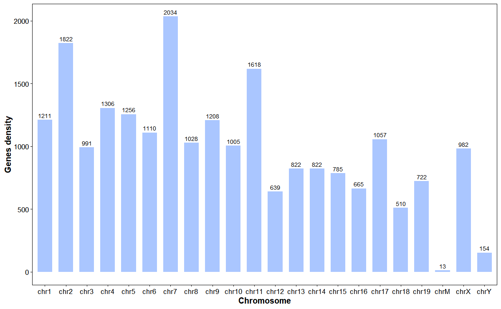

### Plot gene structure (Promoter, 3’UTR, Exon, Intron, 5’UTR)

``` r
# Plot gene structure
plot_gene_structure(
  gff_file = gff_file,
  format = "auto",
  gene_id = "ENSMUSG00000025935",
  upstream = 2000,
  downstream = 200,
  feature_alpha = 0.8,
  intron_width = 1,
  x_breaks = 10,
  arrow_length = 5,
  arrow_count = 1,
  arrow_unit = "pt",
  promoter_color = "#ff8800",
  utr5_color = "#008833",
  utr3_color = "#ff0033",
  exon_color = "#0033ff",
  intron_color = "#333333"
)
```

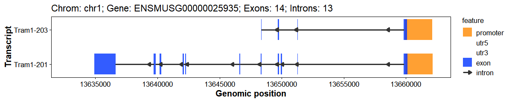

### Plot protein domains from Ensembl

``` r
# Plot TP53 domian
res <- plot_gene_domains(
  gene_name = "TP53",
  species = "hsapiens",
  transcript_id = NULL,
  transcript_choice = "longest",
  palette = "Set 2",
  legend_ncol = 2,
  return_data = TRUE)

res$plot
```

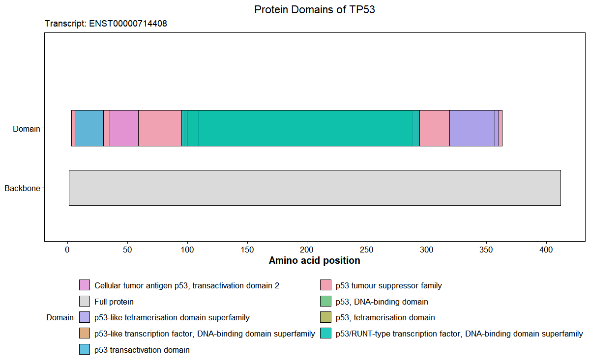

### Plot gene structures for a genomic interval

``` r
# Plot interval structure
plot_interval_structure(
  gff_file = gff_file,
  format = "auto",
  chrom_id = "chr1",
  start = 13600000,
  end = 13800000,
  x_breaks = 10,
  upstream = 2000,
  downstream = 200,
  feature_alpha = 0.8,
  intron_width = 1,
  arrow_count = 1,
  arrow_length = 5,
  arrow_unit = "pt",
  promoter_color = "#ff8800",
  utr5_color = "#008833",
  utr3_color = "#ff0033",
  exon_color = "#0033ff",
  intron_color = "#333333"
)
```

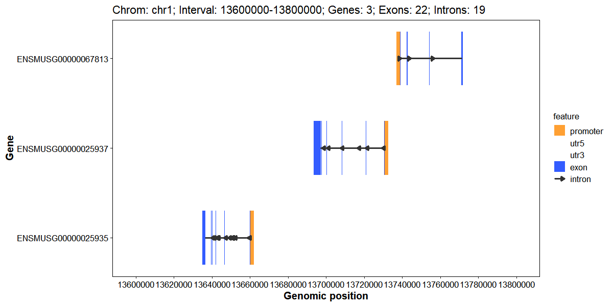

### Plot interval flank structure around a focal gene

``` r
# Neighborhood around a focal gene on its chromosome
plot_interval_flank(
  gff_file = gff_file,
  format = "auto",
  gene_id = "ENSMUSG00000025935",
  flank_upstream = 200000,
  flank_downstream = 200000,
  show_promoters = TRUE,
  upstream = 2000,
  downstream = 200,
  arrow_length = 5,
  arrow_unit = "pt",
  gene_color = "#0088ff",
  promoter_color = "#ff8800",
  label_size = 3
)
```

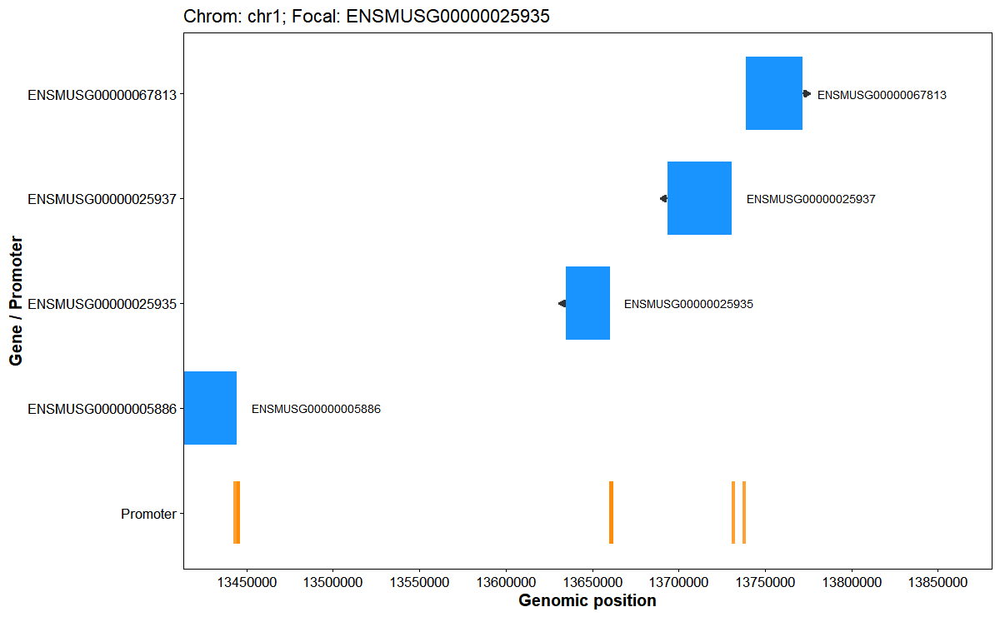

### Plot chromosome structures and gene stats

``` r
# Plot chrom structure
plot_chrom_structure(
  gff_file = gff_file,
  format = "auto",
  orientation = "vertical",
  bar_width = 0.6,
  chrom_alpha = 0.1,
  gene_width = 0.5,
  chrom_color = "#008888",
  gene_color = "#0088ff",
  telomere_color = "#ff0000",
  label_size = 3
)
```

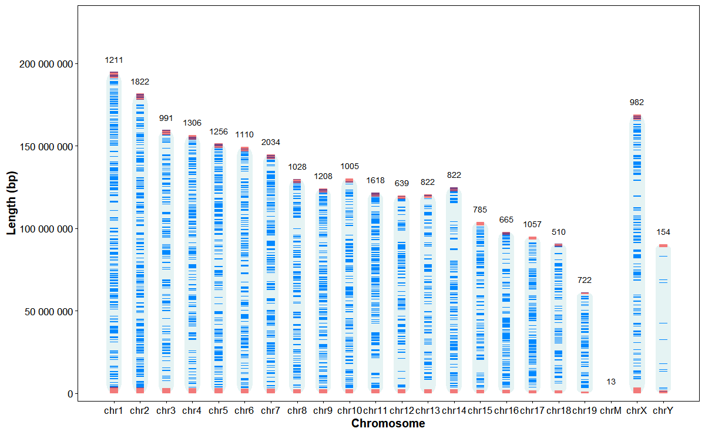

### Plot chromosome structures and gene annotation

``` r
genes <- data.frame(
  gene_id = c("ENSMUSG00000042414", "ENSMUSG00000025935", "ENSMUSG00000048701", "ENSMUSG00000035385"),
  gene_name = c("Prdm14", "Tram1", "Ccdc6", "Ccl2"))

# Vertical, annotate by name
plot_chrom_genes(
  gff_file = gff_file,
  gene_table = genes,
  annotate = "name",
  orientation = "vertical")
```

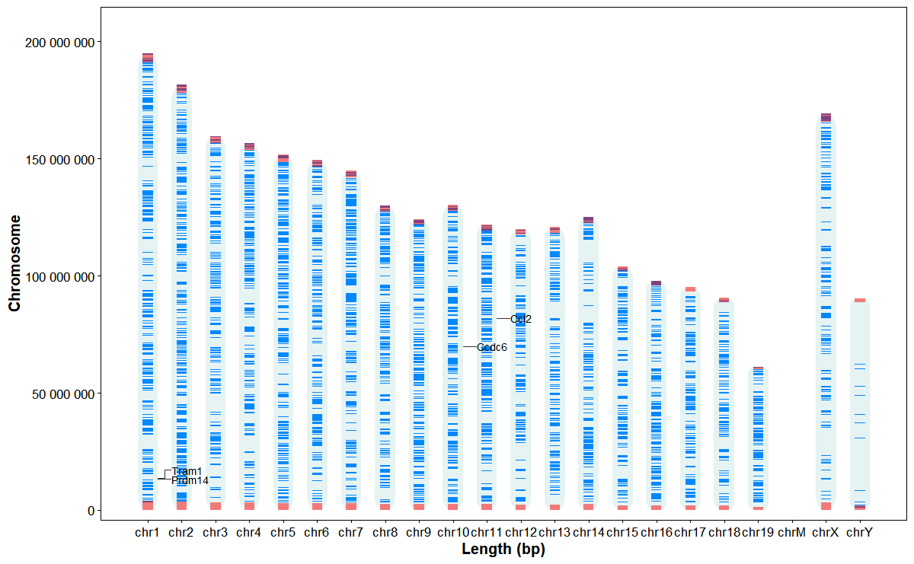

### Plot genomic feature density heatmap

``` r
# Gene density heatmap
plot_chrom_heatmap(
  gff_file = gff_file,
  format = "auto",
  feature = "gene",
  bin_size = 1e6,
  orientation = "horizontal",
  palette = c("#ffffff", "#0055aa"),
  alpha = 0.9
)
```

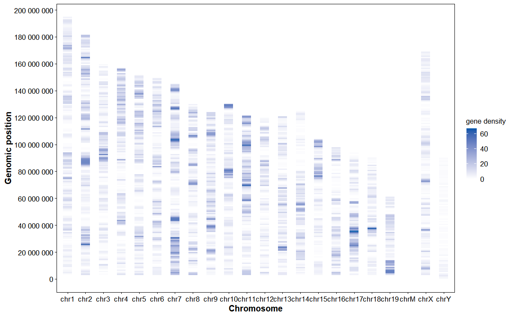

## 8. DEG Anno & Viz

### Annotate differentially expressed genes (DEGs) with chromosome positions

``` r
# Example DEGs GAnnoViz
deg_file <- system.file(
  "extdata",
  "example.deg",
  package = "GAnnoViz")

deg <- read.table(
  file = deg_file,
  header = TRUE,
  sep = "\t",
  na.strings = NA,
  stringsAsFactors = FALSE
)
head(deg)
#>               GeneID baseMean log2FoldChange     lfcSE      stat   pvalue  padj
#> 1 ENSMUSG00000025198    23869      -6.000000 0.2843066 -21.10398 7.31e-74 1e-40
#> 2 ENSMUSG00000025272    40302       5.595767 0.2788325  20.06856 1.39e-64 1e-40
#> 3 ENSMUSG00000064264    13298      -5.534248 0.2955626 -18.72446 3.13e-53 1e-40
#> 4 ENSMUSG00000046432    55113       6.000000 0.3230247  18.57443 5.17e-52 1e-40
#> 5 ENSMUSG00000102989    28945       5.953063 0.3218916  18.49400 2.31e-51 1e-40
#> 6 ENSMUSG00000103364    13437       4.987586 0.2709416  18.40835 1.13e-50 1e-40
```

``` r
# Annotate DEGs with chromosome positions
res <- anno_deg_chrom(
  deg_file = deg_file,
  gff_file = gff_file,
  format = "auto",
  id_col = "GeneID",
  fc_col = "log2FoldChange",
  use_strand = FALSE,
  drop_unmapped = TRUE
)
head(res)
#>   chrom     start       end            gene_id     score strand
#> 1  chr3 116306719 116343630 ENSMUSG00000000340  1.456567      *
#> 2 chr17   6869070   6877078 ENSMUSG00000000579  2.696704      *
#> 3 chr11  54988941  55003855 ENSMUSG00000000594  1.488543      *
#> 4 chr10  77877781  77899456 ENSMUSG00000000730  1.592217      *
#> 5  chr8  71261093  71274068 ENSMUSG00000000791  1.344079      *
#> 6 chr11  83538670  83540181 ENSMUSG00000000982 -2.094984      *
```

### Plot differentially expressed genes (DEGs) volcano

``` r
# Volcano plot
plot_deg_volcano(
  deg_file = deg_file,
  id_col = "GeneID",
  fc_col = "log2FoldChange",
  sig_col = "padj",
  fc_threshold = 1,
  sig_threshold = 0.05,
  point_size = 2,
  point_alpha = 0.5,
  up_color = "#ff0000",
  down_color = "#008800",
  ns_color = "#888888"
)
```

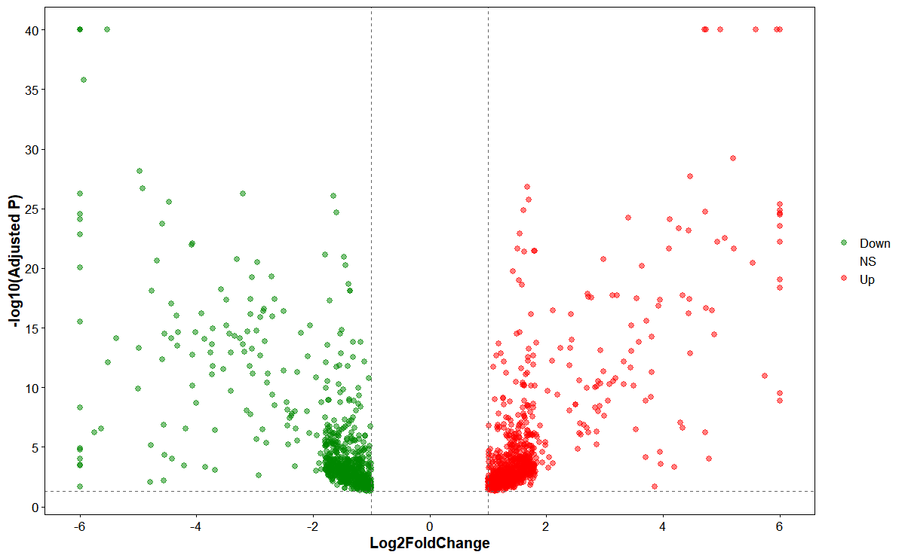

### Plot differentially expressed genes (DEGs) hyper/hypo distributions by chromosome

``` r
# Plot chrom DEGs
plot_deg_chrom(
  deg_file = deg_file,
  gff_file = gff_file,
  format = "auto",
  id_col = "GeneID",
  fc_col = "log2FoldChange",
  violin_scale = "count",
  violin_border = 0.5,
  point_shape = 16,
  point_size = 2,
  jitter_width = 0.2,
  hyper_color = "#ff000088",
  hypo_color = "#00880088"
)
```

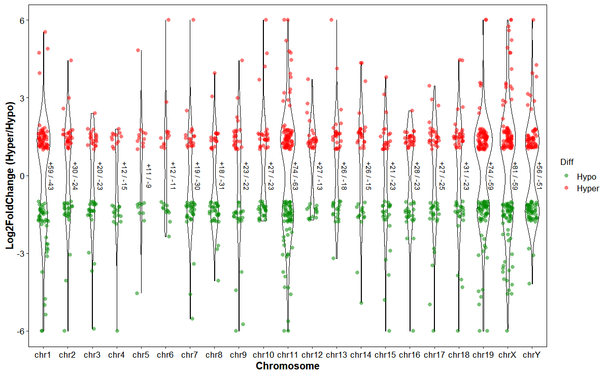

### Plot DEGs up/down along chromosomes

``` r
plot_deg_exp(
  deg_file = deg_file,
  gff_file = gff_file,
  format = "auto",
  id_col = "GeneID",
  fc_col = "log2FoldChange",
  orientation = "horizontal",
  chrom_alpha = 0.1,
  chrom_color = "#008888",
  bar_height = 0.8,
  point_size = 2,
  point_alpha = 0.3,
  up_color = "#ff0000",
  down_color = "#008800",
  mark_style = "point",
  line_width = 0.6,
  line_height = 0.8)
```

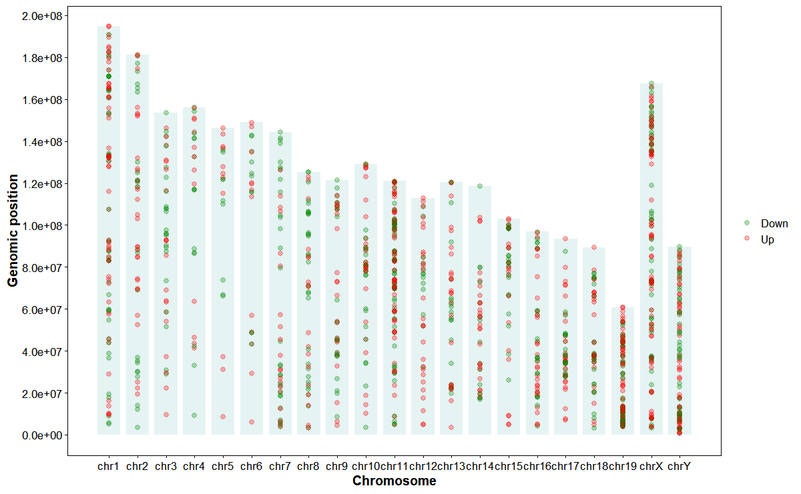

## 9. SNP Anno & Plot

### Annotate FST slide windows with genomic features

``` r
# Annotate FST
fst_file <- system.file(
    "extdata",
    "example.fst",
    package = "GAnnoViz")

fst <- read.table(
  file = fst_file,
  header = TRUE,
  sep = "\t",
  na.strings = "NA",
  stringsAsFactors = FALSE
)
head(fst)
#>   CHROM BIN_START BIN_END N_VARIANTS WEIGHTED_FST     MEAN_FST
#> 1  chr1         1   10000        119  0.034869746  0.027472144
#> 2  chr1     20001   30000        150 -0.009735326 -0.019103882
#> 3  chr1     40001   50000        587 -0.013269573 -0.004886184
#> 4  chr1     60001   70000        256  0.036700847  0.027643440
#> 5  chr1     80001   90000        842  0.020847846  0.011547497
#> 6  chr1    100001  110000        892  0.001750007  0.002121159
```

``` r
res <- anno_fst_dmr(
  gff_file = gff_file,
  format = "auto",
  genomic_ranges = fst_file,
  chrom_col = "CHROM",
  start_col = "BIN_START",
  end_col = "BIN_END",
  upstream = 2000,
  downstream = 200,
  ignore_strand = TRUE,
  features = c("promoter", "UTR5", "gene", "exon", "intron", "CDS", "UTR3", "intergenic")
)
head(res)
#>   CHROM BIN_START BIN_END N_VARIANTS WEIGHTED_FST     MEAN_FST  anno_type
#> 1  chr1         1   10000        119  0.034869746  0.027472144 intergenic
#> 2  chr1     20001   30000        150 -0.009735326 -0.019103882 intergenic
#> 3  chr1     40001   50000        587 -0.013269573 -0.004886184 intergenic
#> 4  chr1     60001   70000        256  0.036700847  0.027643440 intergenic
#> 5  chr1     80001   90000        842  0.020847846  0.011547497 intergenic
#> 6  chr1    100001  110000        892  0.001750007  0.002121159 intergenic
#>   gene_id
#> 1        
#> 2        
#> 3        
#> 4        
#> 5        
#> 6
```

### Annotate DMR slide windows with genomic features

``` r
# Annotate DMR
dmr_file <- system.file(
    "extdata",
    "example.dmr",
    package = "GAnnoViz")

dmr <- read.table(
  file = dmr_file,
  header = TRUE,
  sep = "\t",
  na.strings = "NA",
  stringsAsFactors = FALSE
)
head(dmr)
#>    chr   start     end strand pvalue   qvalue meth.diff
#> 1 chr1 4930001 4932000      *  1e-07 0.009117    89.850
#> 2 chr1 4936001 4938000      *  1e-08 0.005656   -82.314
#> 3 chr1 5670001 5672000      *  1e-09 0.011313   -69.908
#> 4 chr1 5914001 5916000      *  1e-09 0.001782   -93.310
#> 5 chr1 8576001 8578000      *  1e-08 0.009556   -68.589
#> 6 chr1 9098001 9100000      *  1e-07 0.009733   -68.756
```

``` r
res <- anno_fst_dmr(
  gff_file = gff_file,
  format = "auto",
  genomic_ranges = dmr_file,
  chrom_col = "chr",
  start_col = "start",
  end_col = "end",
  upstream = 2000,
  downstream = 200,
  ignore_strand = TRUE,
  features = c("promoter", "UTR5", "gene", "exon", "intron", "CDS", "UTR3", "intergenic")
)
head(res)
#>    chr   start     end strand pvalue   qvalue meth.diff        anno_type
#> 1 chr1 4930001 4932000      *  1e-07 0.009117    89.850      gene,intron
#> 2 chr1 4936001 4938000      *  1e-08 0.005656   -82.314 gene,exon,intron
#> 3 chr1 5670001 5672000      *  1e-09 0.011313   -69.908      gene,intron
#> 4 chr1 5914001 5916000      *  1e-09 0.001782   -93.310       intergenic
#> 5 chr1 8576001 8578000      *  1e-08 0.009556   -68.589      gene,intron
#> 6 chr1 9098001 9100000      *  1e-07 0.009733   -68.756      gene,intron
#>                                       gene_id
#> 1 ENSMUSG00000033813(g),ENSMUSG00000104217(g)
#> 2 ENSMUSG00000033813(g),ENSMUSG00000104217(g)
#> 3                       ENSMUSG00000025905(g)
#> 4                                            
#> 5                       ENSMUSG00000025909(g)
#> 6                       ENSMUSG00000025909(g)
```

### Plot SNP density at chromosome level

``` r
# Plot SNP density
plot_snp_density(
  fst_file = fst_file,
  LOG10 = FALSE,
  bin_size = 1e6,
  density_color = c("#0088ff", "#ff8800", "#ff0000")
)
```

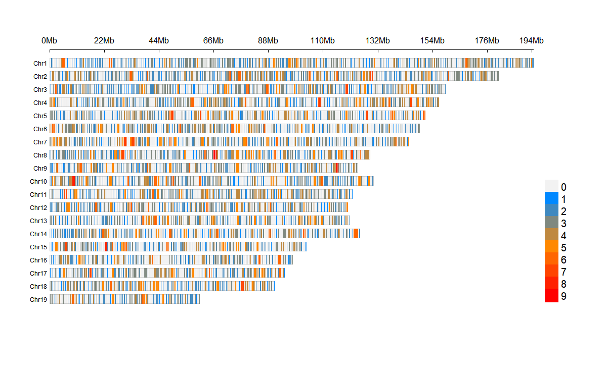

### Plot genomic weighted FST heatmap

``` r
# Plot weighted FST
plot_snp_fst(
  fst_file = fst_file,
  bin_size = 1e6,
  metric = "fst_mean",
  orientation = "horizontal",
  palette = c("#ffffff", "#aa00aa"),
  alpha = 0.9
)
```

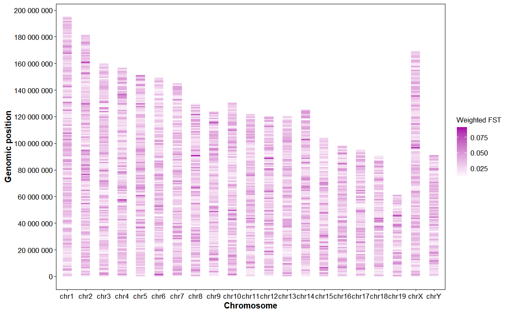

### Plot genomic FST with Top-N gene annotations

``` r
# Chromosome FST with Top-20 gene annotations on chr11
plot_snp_anno(
  fst_file = fst_file,
  gff_file = gff_file,
  format = "auto",
  chrom_id = "chr2",
  top_n = 20,
  orientation = "vertical",
  smooth_span = 0.5,
  fst_color = "#0088ff",
  point_size = 1,
  point_alpha = 0.3,
  label_size = 3,
  connector_dx1 = 2e4,
  connector_dx2 = 4e4,
  gap_frac = 0.05
)
```

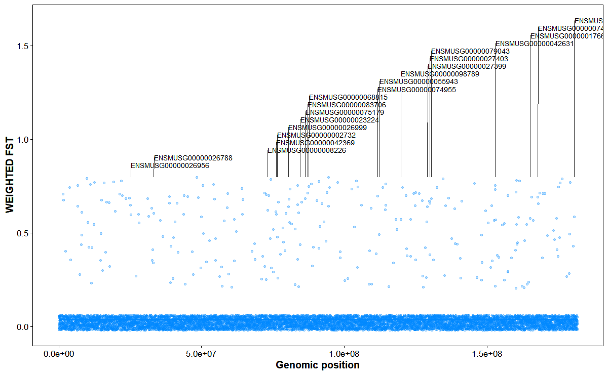

## 10. DMG Anno & Plot

### Plot differentially methylated regions (DMRs) hyper/hypo distributions by chromosome

``` r
# Plot chrom DMRs
plot_dmg_chrom(
  dmr_file = dmr_file,
  violin_scale = "count",
  violin_border = 0.5,
  point_shape = 8,
  point_size = 2,
  jitter_width = 0.2,
  hyper_color = "#ff880088",
  hypo_color = "#0088ff88"
)
```

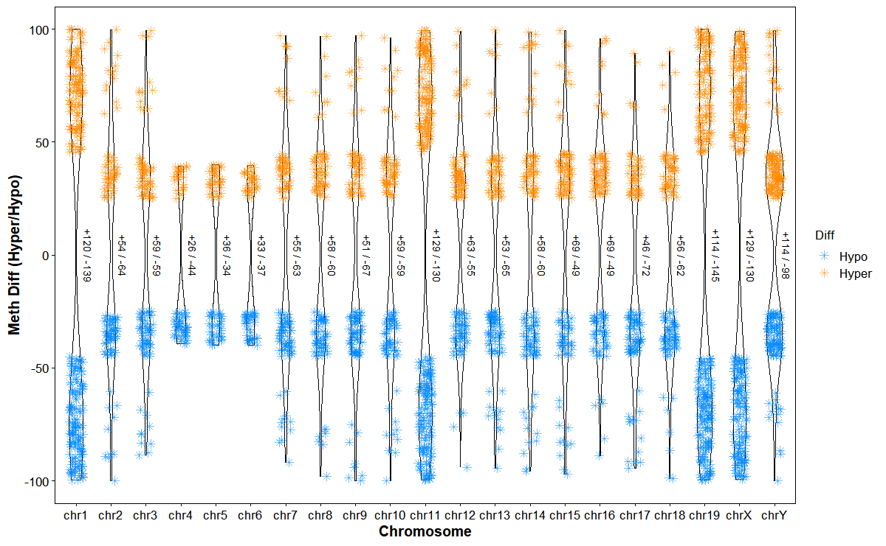

### Plot DMGs hyper/hypo along chromosomes

``` r
# Plot DMG expression
plot_dmg_exp(
  dmr_file = dmr_file,
  orientation = "horizontal",
  chrom_alpha = 0.1,
  chrom_color = "#008888",
  point_size = 1,
  point_alpha = 0.3,
  hyper_color = "#ff0000",
  hypo_color = "#008800",
  mark_style = "line",
  line_width = 0.6,
  line_height = 0.8)
```

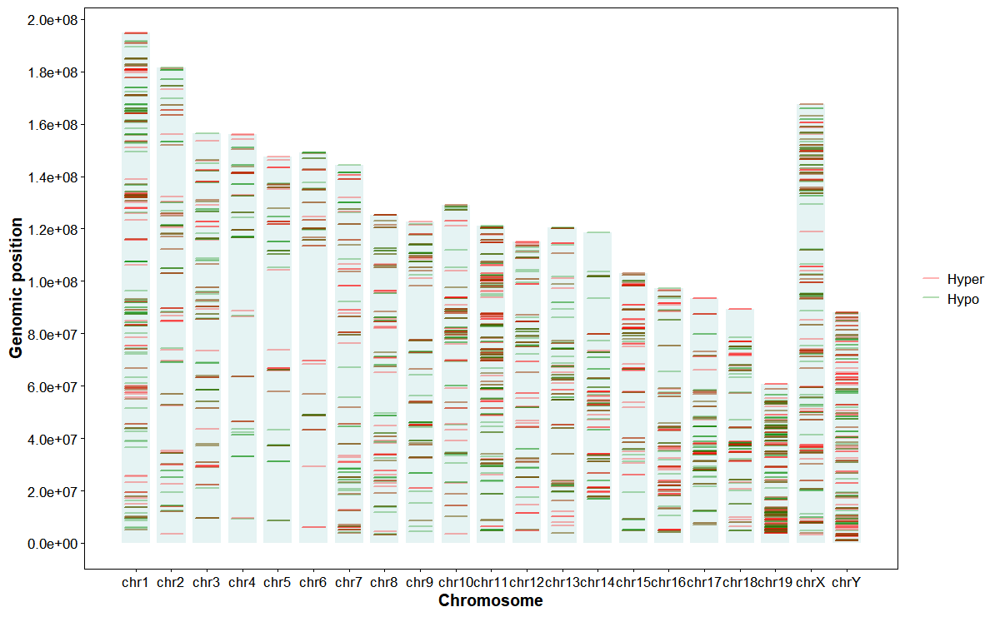

### Plot DMGs circos across chromosomes

``` r
# Plot DMG circos
plot_dmg_circos(
  dmr_file = dmr_file,
  gff_file = gff_file,
  format = "auto",
  label_type = "name",
  gene_table = NULL,
  y_transform = "none",
  chrom_height = 0.08,
  chrom_color = "#eeeeee",
  chrom_border = "#cccccc",
  chrom_cex = 0.8,
  gap_degree = 1,
  x_tick_by = 2e7,
  axis_cex = 0.5,
  last_gap_degree = 3,
  scatter_height = 0.15,
  top_up = 30,
  top_down = 30,
  up_color = "#ff0000",
  down_color = "#008800",
  point_cex = 0.5,
  annotation_height = 0.18,
  label_cex = 0.5,
  label_rotate = 0,
  label_font = 1,
  connector_lwd = 0.5,
  connector_col = "#333333",
  connector_len = 0.2,
  connector_elbow = 0.8)
```

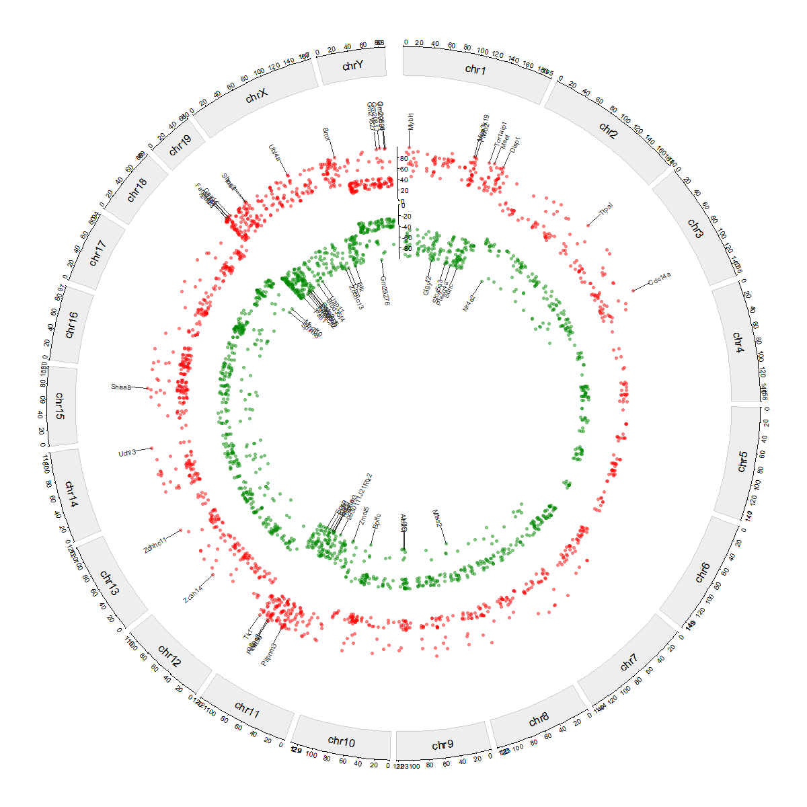

### Plot DMGs manhattan plot across chromosomes

``` r
# Plot DMG Manhattan
plot_dmg_manhattan(
  dmr_file = dmr_file,
  gff_file = gff_file,
  format = "auto",
  gene_table = NULL,
  label_type = "name",
  label_col = NULL,
  y_transform = "none",
  chromosome_spacing = 1e6,
  hyper_color = "#ff0000",
  hypo_color = "#008800",
  point_size = 1,
  point_alpha = 0.5,
  label_top_n = 10,
  label_size = 3,
  gap_frac = 0.04,
  connector_dx1 = NULL,
  connector_dx2 = NULL,
  connector_elbow = 0.8,
  connector_tilt_frac = 0.2)
```

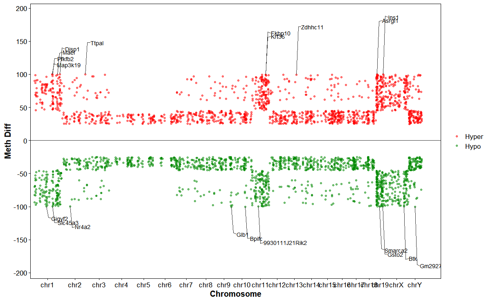

### Plot chromosomal DMGs trend

``` r
# Plot DMR trend
plot_dmg_trend(
  chrom_id = "chr1",
  dmr_file = dmr_file,
  smooth_span = 0.1,
  hyper_color = "#ff0000",
  hypo_color = "#008800",
  point_size = 3,
  point_alpha = 0.5
)
```

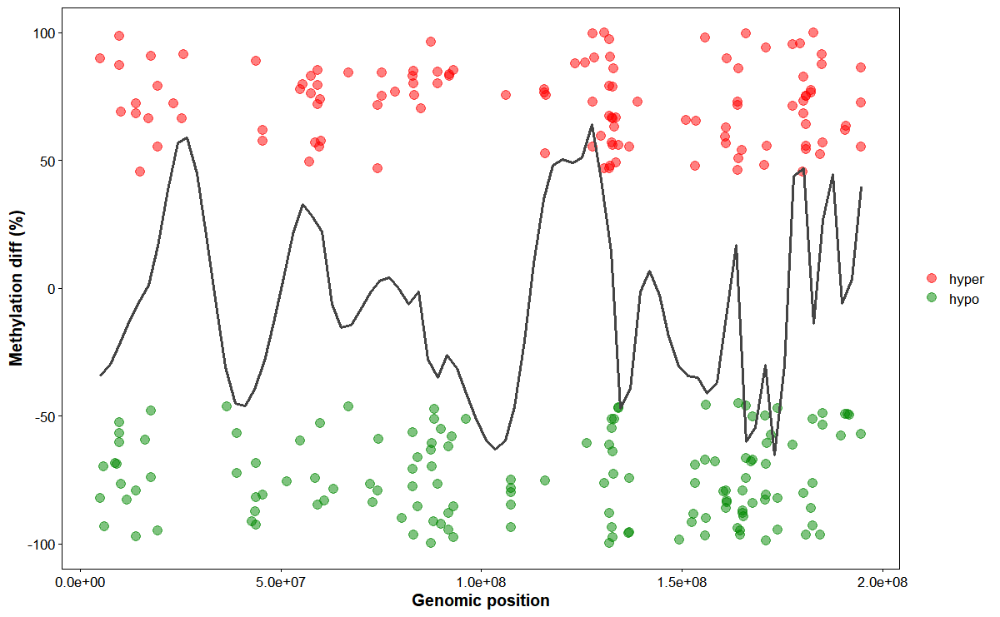

## 11. Session Information

``` r
sessionInfo()
#> R version 4.5.2 (2025-10-31 ucrt)
#> Platform: x86_64-w64-mingw32/x64
#> Running under: Windows 11 x64 (build 26220)
#> 
#> Matrix products: default
#>   LAPACK version 3.12.1
#> 
#> locale:
#> [1] LC_COLLATE=Chinese (Simplified)_China.utf8 
#> [2] LC_CTYPE=Chinese (Simplified)_China.utf8   
#> [3] LC_MONETARY=Chinese (Simplified)_China.utf8
#> [4] LC_NUMERIC=C                               
#> [5] LC_TIME=Chinese (Simplified)_China.utf8    
#> 
#> time zone: Etc/GMT-8
#> tzcode source: internal
#> 
#> attached base packages:
#> [1] stats     graphics  grDevices utils     datasets  methods   base     
#> 
#> other attached packages:
#> [1] ggplot2_4.0.1  GAnnoViz_0.1.0
#> 
#> loaded via a namespace (and not attached):
#>   [1] tidyselect_1.2.1            dplyr_1.1.4                
#>   [3] farver_2.1.2                blob_1.2.4                 
#>   [5] filelock_1.0.3              Biostrings_2.78.0          
#>   [7] S7_0.2.1                    bitops_1.0-9               
#>   [9] fastmap_1.2.0               RCurl_1.98-1.17            
#>  [11] BiocFileCache_3.0.0         GenomicAlignments_1.46.0   
#>  [13] XML_3.99-0.20               digest_0.6.39              
#>  [15] lifecycle_1.0.4             KEGGREST_1.50.0            
#>  [17] RSQLite_2.4.5               magrittr_2.0.4             
#>  [19] compiler_4.5.2              progress_1.2.3             
#>  [21] rlang_1.1.6                 tools_4.5.2                
#>  [23] CMplot_4.5.1                yaml_2.3.11                
#>  [25] rtracklayer_1.70.0          knitr_1.50                 
#>  [27] labeling_0.4.3              prettyunits_1.2.0          
#>  [29] S4Arrays_1.10.0             bit_4.6.0                  
#>  [31] curl_7.0.0                  DelayedArray_0.36.0        
#>  [33] xml2_1.5.1                  RColorBrewer_1.1-3         
#>  [35] abind_1.4-8                 BiocParallel_1.44.0        
#>  [37] purrr_1.2.0                 txdbmaker_1.6.0            
#>  [39] withr_3.0.2                 BiocGenerics_0.56.0        
#>  [41] grid_4.5.2                  stats4_4.5.2               
#>  [43] colorspace_2.1-2            scales_1.4.0               
#>  [45] dichromat_2.0-0.1           biomaRt_2.66.0             
#>  [47] SummarizedExperiment_1.40.0 cli_3.6.5                  
#>  [49] rmarkdown_2.30              crayon_1.5.3               
#>  [51] generics_0.1.4              otel_0.2.0                 
#>  [53] rstudioapi_0.17.1           httr_1.4.7                 
#>  [55] rjson_0.2.23                DBI_1.2.3                  
#>  [57] cachem_1.1.0                stringr_1.6.0              
#>  [59] splines_4.5.2               parallel_4.5.2             
#>  [61] AnnotationDbi_1.72.0        XVector_0.50.0             
#>  [63] restfulr_0.0.16             matrixStats_1.5.0          
#>  [65] vctrs_0.6.5                 Matrix_1.7-4               
#>  [67] jsonlite_2.0.0              hms_1.1.4                  
#>  [69] IRanges_2.44.0              S4Vectors_0.48.0           
#>  [71] bit64_4.6.0-1               GenomicFeatures_1.62.0     
#>  [73] glue_1.8.0                  codetools_0.2-20           
#>  [75] shape_1.4.6.1               stringi_1.8.7              
#>  [77] gtable_0.3.6                GenomeInfoDb_1.46.2        
#>  [79] BiocIO_1.20.0               GenomicRanges_1.62.0       
#>  [81] UCSC.utils_1.6.0            tibble_3.3.0               
#>  [83] pillar_1.11.1               rappdirs_0.3.3             
#>  [85] htmltools_0.5.9             Seqinfo_1.0.0              
#>  [87] circlize_0.4.17             R6_2.6.1                   
#>  [89] dbplyr_2.5.1                httr2_1.2.2                
#>  [91] evaluate_1.0.5              Biobase_2.70.0             
#>  [93] lattice_0.22-7              png_0.1-8                  
#>  [95] Rsamtools_2.26.0            cigarillo_1.0.0            
#>  [97] memoise_2.0.1               nlme_3.1-168               
#>  [99] SparseArray_1.10.2          mgcv_1.9-4                 
#> [101] xfun_0.54                   GlobalOptions_0.1.3        
#> [103] MatrixGenerics_1.22.0       pkgconfig_2.0.3
```
